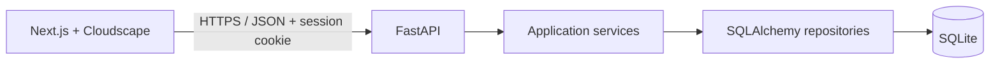
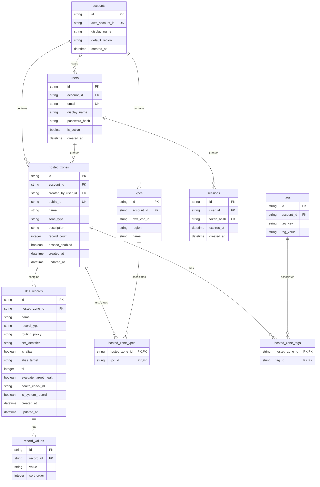

# Route 53 Console Clone

A polished, local-first Route 53 console experience. It recreates the hosted-zone and DNS-record workflows without performing real DNS changes. The interface uses AWS Cloudscape components, and the API persists data in SQLite.

## What is included

- Mock sign-in, sign-out, protected routes, account identity, and region display.
- Hosted-zone search, sort, pagination, create, edit, and guarded deletion.
- Public and private zones, mock VPC selection, descriptions, and tags.
- Default NS and SOA records when a zone is created.
- DNS record CRUD, bulk deletion, type filtering, per-type validation, and read-only system records.
- BIND import and JSON/BIND export.
- Cloudscape console shell, dark/light preference, notifications, and keyboard shortcuts.
- Stub pages for dashboard, health checks, traffic policies, resolver, and profiles.

## Architecture



The frontend is intentionally feature-oriented (`features/hosted-zones`, `features/records`) and calls a typed API client. The backend separates HTTP routers, Pydantic schemas, services, repositories, and SQLAlchemy models. This keeps UI concerns, orchestration, persistence, and DNS validation independently testable.

## Repository layout

```text
.
├── frontend/                 # Next.js App Router application
│   ├── app/                  # Routes and route layouts
│   ├── components/console/   # AWS-like shared console shell
│   ├── features/             # Hosted-zone and record workflows
│   ├── lib/api/              # Typed REST client
│   ├── providers/            # Auth, flash messages, theme, shortcuts
│   ├── Dockerfile
│   └── vercel.json
├── backend/                  # FastAPI application
│   ├── app/api/              # Routers and dependencies
│   ├── app/core/             # Settings, database, errors, security
│   ├── app/models/           # SQLAlchemy ORM models
│   ├── app/repositories/     # Query and persistence layer
│   ├── app/schemas/          # Pydantic request/response contracts
│   ├── app/services/         # Domain logic and validation
│   ├── app/scripts/seed.py
│   ├── alembic/              # Database migration history
│   ├── tests/
│   └── Dockerfile
├── docker-compose.yml
├── render.yaml
└── railway.toml
```

## Run locally with Docker

1. Copy the example environment file and set a long development secret.

   ```bash
   cp .env.example .env
   ```

2. Build and start both services.

   ```bash
   docker compose up --build
   ```

3. Open [http://localhost:3010](http://localhost:3010). The API documentation is at [http://localhost:8011/api/docs](http://localhost:8011/api/docs).

The `route53-data` Docker volume retains SQLite data across container recreation. To reset only the demo data, run `docker compose down -v` and start it again.

### Demo account

| Email | Password | AWS account | Region |
| --- | --- | --- | --- |
| `student@example.com` | `Password123!` | `610867948442` | `us-east-1` |

## Run without Docker

### Backend

Requires Python 3.12+ and [uv](https://docs.astral.sh/uv/).

```bash
cd backend
cp .env.example .env
uv sync --all-groups
uv run alembic upgrade head
uv run python -m app.scripts.seed
uv run uvicorn app.main:app --reload --port 8011
```

### Frontend

Requires Node.js 22+.

```bash
cd frontend
cp .env.example .env.local
npm ci
npm run dev
```

`NEXT_PUBLIC_API_BASE_URL` must point to the API version prefix, for example `http://localhost:8011/api/v1`.

## Configuration

Backend settings are prefixed with `ROUTE53_` and may be placed in `backend/.env`.

| Variable | Local value | Hosted-demo value | Purpose |
| --- | --- | --- | --- |
| `ROUTE53_DATABASE_URL` | `sqlite:///./route53.db` | `sqlite:////data/route53.db` | SQLite connection string |
| `ROUTE53_SESSION_SECRET` | development value | long random secret | Signs session tokens |
| `ROUTE53_CORS_ORIGINS` | `http://localhost:3010` | exact Vercel URL | Comma-separated allowed browser origins |
| `ROUTE53_SECURE_COOKIES` | `false` | `true` | Requires HTTPS for the session cookie |
| `ROUTE53_COOKIE_SAMESITE` | `lax` | `none` | Use `none` when frontend and API have different sites |
| `NEXT_PUBLIC_API_BASE_URL` | `http://localhost:8011/api/v1` | deployed API `/api/v1` URL | Frontend API endpoint, set at build time |

For a cross-origin hosted frontend, `ROUTE53_SECURE_COOKIES=true`, `ROUTE53_COOKIE_SAMESITE=none`, and a specific (never wildcard) CORS origin are required. `allow_credentials` is enabled by the API.

## Database schema

UUID-like IDs are application-generated strings. All timestamps are UTC. SQLite foreign-key enforcement is enabled by the database setup.



Key integrity rules and indexes:

- `accounts.aws_account_id`, `users.email`, `sessions.token_hash`, and `hosted_zones.public_id` are unique.
- Hosted-zone names are normalized to lowercase absolute FQDNs. Zones are indexed by account, name, type, and creation date.
- DNS records are indexed by zone/name/type and protected by a uniqueness constraint on zone, name, type, routing policy, and set identifier.
- Record values are ordered using `sort_order` and cascade-delete with their record.
- Association tables use composite primary keys to prevent duplicate tags or VPC links.
- Deleting a zone cascades to DNS records, values, tags links, and VPC links. User/account deletion is restricted where it would orphan owned resources.

Migrations live in `backend/alembic/versions`. Apply them using `uv run alembic upgrade head` or automatically through the backend container entrypoint.

## REST API overview

The versioned API prefix is `/api/v1`. Unauthenticated protected endpoints return `401`; invalid resources return `404`; domain-rule errors return the common JSON error envelope:

```json
{
  "error": {
    "code": "validation_error",
    "message": "A human-readable explanation",
    "details": []
  }
}
```

| Method | Path | Request body / query | Success response |
| --- | --- | --- | --- |
| `GET` | `/health` | — | `{ "status": "ok" }` |
| `POST` | `/auth/login` | `{ email, password }` | `200` session/user/account data and HttpOnly cookie |
| `POST` | `/auth/logout` | — | `204`, clears the session cookie |
| `GET` | `/auth/me` | — | `200` current user, account, and region |
| `GET` | `/hosted-zones` | `page`, `page_size`, `search`, `type`, `sort_by`, `sort_direction` | paginated hosted-zone summaries |
| `POST` | `/hosted-zones` | hosted-zone create payload | `201` hosted-zone detail |
| `GET` | `/hosted-zones/{zoneId}` | — | hosted-zone detail |
| `PATCH` | `/hosted-zones/{zoneId}` | `{ description?, tags? }` | updated hosted-zone detail |
| `DELETE` | `/hosted-zones/{zoneId}` | `{ confirmation: "delete" }` | `204` if only system records remain |
| `GET` | `/hosted-zones/{zoneId}/export` | `format=json\|bind` | JSON download or BIND text download |
| `POST` | `/hosted-zones/{zoneId}/import` | `{ content, format: "BIND" }` | `201 { created_count }` |
| `GET` | `/hosted-zones/{zoneId}/records` | `page`, `page_size`, `search`, `type`, sorting fields | paginated DNS records |
| `POST` | `/hosted-zones/{zoneId}/records` | DNS record write payload | `201` DNS record |
| `GET` | `/hosted-zones/{zoneId}/records/{recordId}` | — | DNS record |
| `PATCH` | `/hosted-zones/{zoneId}/records/{recordId}` | DNS record write payload | updated DNS record |
| `DELETE` | `/hosted-zones/{zoneId}/records/{recordId}` | — | `204` |
| `POST` | `/hosted-zones/{zoneId}/records/bulk-delete` | `{ record_ids: ["…"] }` | deleted IDs and failures |
| `GET` | `/meta/record-types` | — | supported record types |
| `GET` | `/vpcs` | `region`, `search` | mock VPCs for the signed-in account |

### Core payload shapes

```json
// POST /hosted-zones
{
  "name": "example.com",
  "description": "Production site",
  "type": "PUBLIC",
  "vpc_ids": [],
  "tags": [{ "key": "environment", "value": "production" }]
}

// POST/PATCH /hosted-zones/{zoneId}/records
{
  "name": "www.example.com",
  "record_type": "A",
  "ttl": 300,
  "values": ["203.0.113.10"],
  "routing_policy": "SIMPLE",
  "evaluate_target_health": false
}

// paginated collection response
{
  "items": [],
  "pagination": { "page": 1, "page_size": 20, "total": 0, "total_pages": 0 }
}
```

The interactive OpenAPI documentation at `/api/docs` is the canonical field-level contract.

## DNS behavior and validation

Supported types are `A`, `AAAA`, `CNAME`, `TXT`, `MX`, `NS`, `PTR`, `SRV`, `CAA`, and read-only `SOA`. The validation service checks IPv4/IPv6 addresses, FQDNs, MX priority, SRV layout, CAA flags/tag/value, and TXT quote rules. A CNAME cannot coexist with any other record type at the same name. Alias records cannot contain literal values and have no TTL. TTL values must fit Route 53-style API bounds.

The application creates NS and SOA system records for every new hosted zone. They cannot be edited or deleted. A zone cannot be deleted while it contains non-system records.

## Keyboard shortcuts

| Shortcut | Action |
| --- | --- |
| `Alt+H` | Open hosted zones |
| `Alt+N` | Create a hosted zone, or a record when viewing a zone |
| `Alt+M` | Toggle dark/light mode |

Shortcuts do not run while typing in a form field.

## Tests and quality checks

```bash
cd backend
uv run ruff format app tests
uv run ruff check app tests
uv run pytest

cd ../frontend
npm run lint
npm run build
```

Backend tests cover sign-in, hosted-zone lifecycle and deletion protection, record validation, and BIND import/export. Frontend build verification checks route compilation and type safety.

## Hosted demo deployment

Deployment templates are included but no cloud resources are created automatically.

### Frontend on Vercel

1. Import the repository and set the Vercel project root directory to `frontend`.
2. Set `NEXT_PUBLIC_API_BASE_URL` to `https://<your-api-domain>/api/v1`.
3. Deploy. The included `frontend/vercel.json` uses deterministic dependency installation.

### API on Render

1. Create a Blueprint from the repository; Render reads `render.yaml`.
2. Set `ROUTE53_CORS_ORIGINS` to the exact Vercel production URL, for example `https://route53-demo.vercel.app`.
3. Keep the generated secret and the attached `/data` disk. The database URL is already configured as `sqlite:////data/route53.db`.
4. After the API deploys, use its URL in the Vercel environment variable and redeploy the frontend.

### API on Railway

1. Create a service from this repository; `railway.toml` selects `backend/Dockerfile` and the health check.
2. Attach a Railway Volume at `/data`.
3. Set `ROUTE53_DATABASE_URL=sqlite:////data/route53.db`, `ROUTE53_SESSION_SECRET`, `ROUTE53_CORS_ORIGINS`, `ROUTE53_SECURE_COOKIES=true`, and `ROUTE53_COOKIE_SAMESITE=none`.
4. Set the Railway public API URL in Vercel as described above.

SQLite is a strong fit for the take-home demo because the persistent disk preserves all data without another service. A horizontally scaled production deployment should migrate to PostgreSQL and replace the local session table with shared storage.

## Design decisions and limitations

- The app intentionally models console workflows only; it does not call AWS or publish DNS.
- Routing policy is currently limited to `SIMPLE`; weighted, latency, failover, geolocation, and multivalue policies are out of scope.
- DNSSEC, health checks, traffic policies, Resolver, Profiles, and dashboard data are present as console stubs where appropriate.
- BIND import accepts common record syntax and skips the zone’s generated SOA/NS records; it is not a complete BIND parser.
- Authentication is seeded mock authentication. Production use needs a real identity provider, CSRF posture, credential rotation, rate limiting, and audit logging.
- Cross-origin cookie demos need HTTPS and carefully scoped CORS. Using a shared custom domain for frontend and API simplifies cookie policy.
